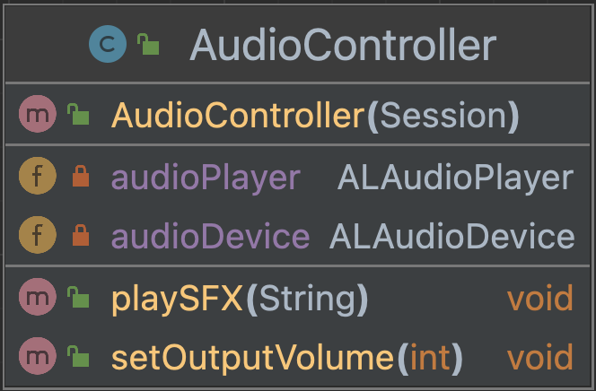

# Audio module NAO

In this module we imported the ALAudioPlayer 
and ALAudioDevice API's. We created a constructor to be able to use 
these methods in the NAO class. We created methods to utilize the 
functions in the API's. The first method is to play a wav or ogg
file. The second method is to control the output volume of the NAO.

The UML diagram looks like this:
