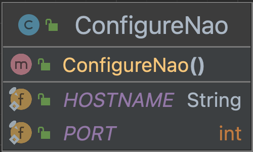

# Configuration module NAO

### ConfigureNao

The first class is the ConfigureNao class that 
says what the robot name is and the port number.

This is the UML diagram:  

### Setup 

The second class is the Setup class. In that class we made a constructor that sets up the ALSystem API.
We made a method to change the NAO's name to our desired name.

This is the UML diagram: 
