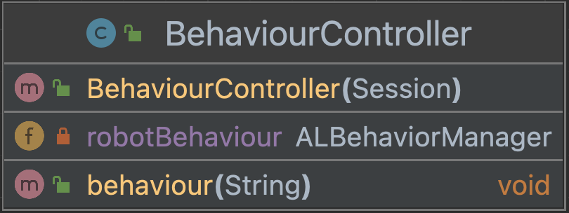

# Core module NAO

In this class we import the ALBehaviourManager 
and made a constructor to use the methods we 
created. The method we created makes its possible
to use the imported Choregraphe behaviours.

This is the UML diagram:
