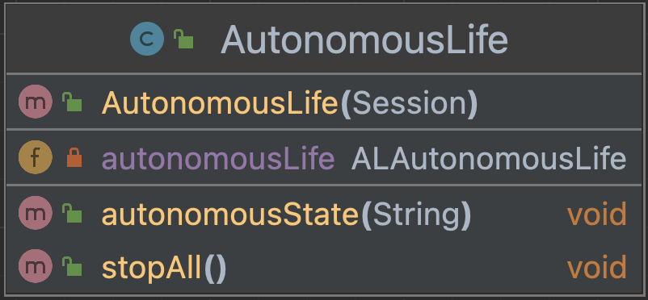
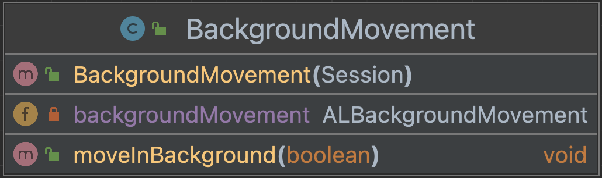
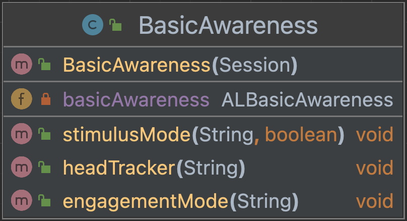

# Interaction engine module NAO

This module consists of three classes that utilize the interaction engine module. 

### AutonomousLife
Consists of an import for the ALAutonomousLife, a constructor
and two methods. One method to determine the autonomous state and 
one method to stop the autonomous behaviour.

This is the UML diagram:

### BackgroundMovement
Consists of an import for the ALBackgroundMovement, a constructor
and one method. The method takes a boolean value to enable or 
disable.
This is the UML diagram:

### BasicAwareness
Consists of an import for the ALBasicAwareness, a constructor
and three methods. Each method tells the autonomous life API how 
to behave and how to react when something happens. 

This is the UML diagram:
