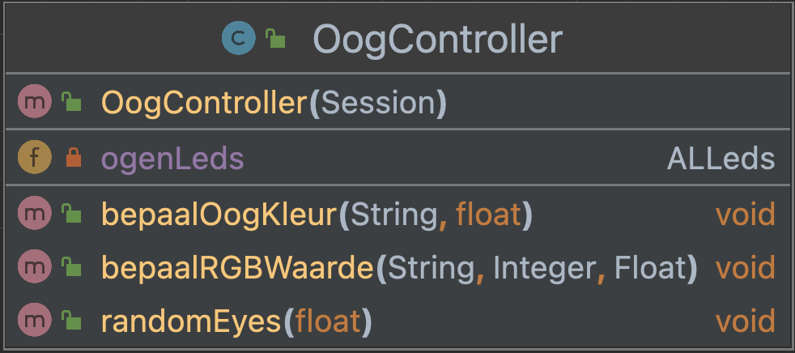

# LED's module NAO

This class is designed to control the NAO's eye colour.
We created a method to set a generic colour, a method to 
set an RGB value as the eye colour and a method to get
random eye colour. 

This is the UML diagram:
