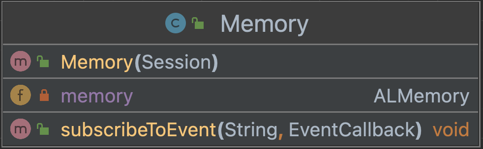

# Memory module NAO
This class is designed to subscribe to an event 
subsequently an action should be undertaken. We 
created a method to do that and using the ALMemory API
as well as a constructor to use the method in other classes.

This is the UML diagram:
