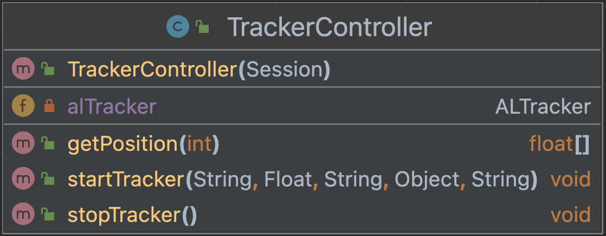
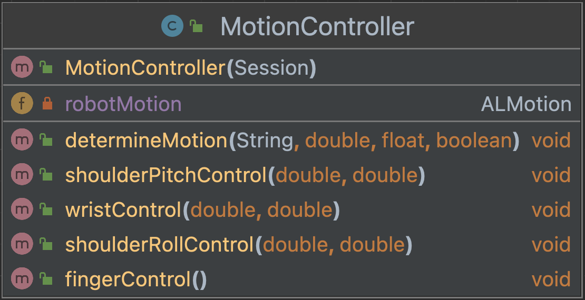

# Motion module NAO

This module has three classes that control 
different aspects of motion on the NAO. 

### PostureController
Consists of an import 
for the ALRobotPosture API, one method and a constructor. 
The method sets the robot posture to one of eight 
default positions. 

This is the UML diagram:

### TrackerController
Consists of an import
for the ALTracker API, three methods and a constructor.
The `public void startTracker` method determines the target, how to
track the target and some other criteria. 
The `public void stopTracker` method stops the tracker from tracking 
whatever it was tracking.
And finally the `public float[] getPosition` gets the position
of the object it is tracking and returns it in an array.

This is the UML diagram:

### MotionController
Consists of an import for the ALMotion API, five methods and a 
constructor. We created a method to control the shoulder roll, 
the shoulder pitch, open fingers and wrist YAW.

This is the UML diagram: 
