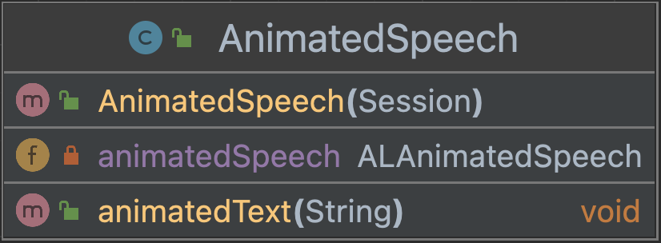

# Speech module NAO

This module has two classes that control different aspects 
of the speech module.

### AnimatedSpeech
Consists of an import for the ALAnimatedSpeech, a constructor
and one method.

This is the UML diagram: 

### TextToSpeech
Consists of an import for the ALTextToSpeech, a constructor
and two methods. One method to turn a string into speech 
and one method to set the language of the NAO.

This is the UML diagram:
