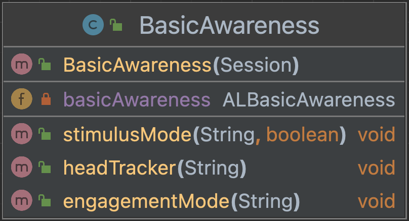

# Vision module NAO

This module consists of one class that manipulates the 
NAO's vision to its advantage.

### BasisAwareness
Consists of an import for the ALBasicAwareness API, a 
constructor and three methods. 

This is the UML diagram:

### RedBallDetection
Consists of an import for the ALRedBallDetection API, a
constructor and two methods. One method to subscribe and 
one to unsubscribe.

This is the UML diagram:
